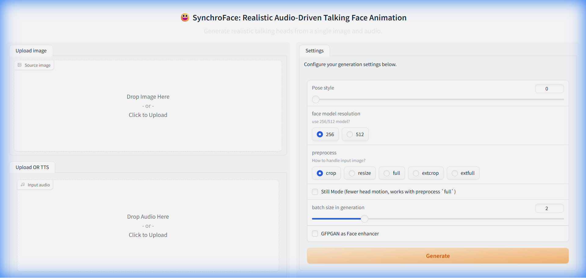

# SynchroFace

**SynchroFace**: Realistic Audio-Driven Talking Face Animation.



## Overview
SynchroFace generates realistic 3D motion coefficients for stylized audio-driven single image talking face animation. It takes a single image and an audio file as input and produces a video of the face talking in sync with the audio.

## Features
- **Realistic Animation**: Generates high-quality lip-sync and head motion.
- **Single Image Input**: Only requires one source image.
- **Audio Driven**: Driven by any speech audio.
- **Web UI**: Easy to use Gradio interface.

## Installation
1. Install [Python 3.8+](https://www.python.org/downloads/).
2. Install [ffmpeg](https://ffmpeg.org/download.html).
3. Clone the repository.
4. Run `webui.bat` to start the application.

## Usage
### Web UI
Run `webui.bat` and open the link provided (usually `http://127.0.0.1:7860`).

### CLI
```bash
python inference.py --driven_audio <audio_path> --source_image <image_path>
```

## License
[MIT](LICENSE)
